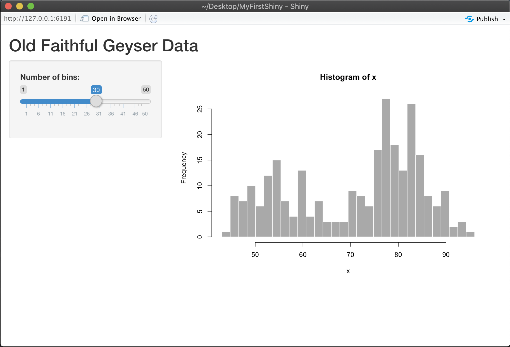

# (PART) 快速上手 {-} 

# 前言 {#intro}

[Shiny App](https://shiny.rstudio.com/){target="_blank"} 是 [RStudio](https://rstudio.com/){target="_blank"}推出供R語言使用的**網頁應用框架（Web application framework）**，透過Shiny，使用者可以輕鬆地將資料分析結果轉換成**互動式的網頁應用程式**，簡單來說就是動態網站，如果不做客製化的使用者介面調整，不用另外學習其他網頁程式語言（如HTML, CSS, JavaScript等），若要使用Shiny， [RStudio IDE](https://rstudio.com/products/rstudio/download/#download){target="_blank"}提供完整測試預覽功能，建議一起使用。使用前必須先安裝並載入`shiny` package [@R-shiny]


```{r installShiny, eval=F}
install.packages("shiny")
library(shiny)
```

安裝完成後，若想快速體驗Shiny App的效果，可執行下列程式碼，查看Shiny package內提供的11個網頁部署範例，以及參考範例相對應的原始碼：

```{r shinyEx, eval=F, message=F}
runExample("01_hello") # a histogram
runExample("02_text") # tables and data frames
runExample("03_reactivity") # a reactive expression
runExample("04_mpg") # global variables
runExample("05_sliders") # slider bars
runExample("06_tabsets") # tabbed panels
runExample("07_widgets") # help text and submit buttons
runExample("08_html") # Shiny app built from HTML
runExample("09_upload") # file upload wizard
runExample("10_download") # file download wizard
runExample("11_timer") # an automated timer
```

使開始資料分析專案類似，若有使用RStudio IDE，在開始建構Shiny App前建議先新增一個Shiny Project，建構方式可參考下方影片:

<iframe width="90%" height="400" src="https://www.youtube.com/embed/r186TTpluYw" frameborder="0" autoplay="1"></iframe>

步驟如下: 

1. 點選**Create a Project**
2. 依需求選擇需要開新資料夾或是使用原有資料夾
3. 選擇**Shiny Web Application** Project
4. 輸入Project name，也會同時是資料夾的名稱
5. 完成新增Shiny Project，資料夾中會有一個**app.R**檔案，即為撰寫Shiny App前後端程式碼的地方
6. 點選程式碼上方的Run，就會跑出經典的Shiny App範例程式

Run App所在位置：

```{r echo=FALSE}
knitr::include_graphics("figure/run.png")
```

經典的直方圖Shiny範例程式：

```{r echo=FALSE}

```

本書接下來的章節會針對Shiny App架構、前後端程式與元件、客製化設計、程式測試以及部屬上線等內容逐一介紹。
