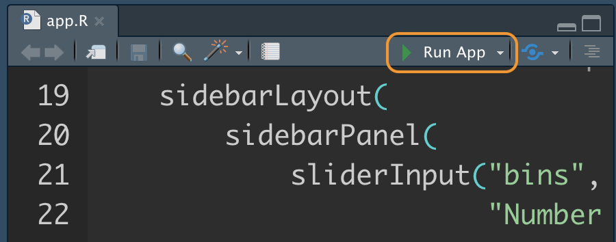
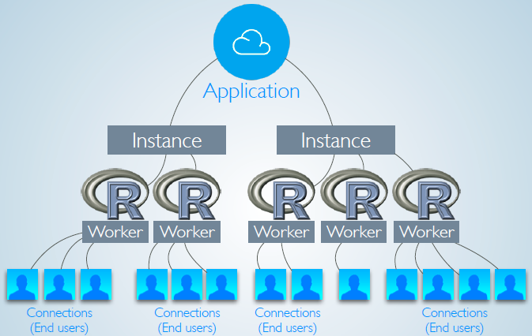

# Shiny App架構 {#structure}

Shiny App是由**使用者介面(User Interface)**與**伺服器端程式 (Server Instruction)**組合而成，分別負責下列功能：

- **使用者介面(User Interface)** (前端)：
  - **輸入元件**：
    - 讓使用者可依需求改變各項數值，如篩選閾值、分析項目選擇等（如只要分析50元以下的商品）
    - 讓使用者觸發程式執行（如點選“計算”按鈕等）
  - **輸出元件**：呈現分析結果，可以用文字、圖、表或是地圖等方式呈現
  
- **伺服器端程式 (Server Instruction)** (後端)：產出使用者介面所需的**輸出元件**


## 單一整合程式 app.R
在新增Shiny Project時，RStudio IDE會自動生成單一整合程式`app.R`，此程式碼的檔名是固定的，不能修改，內容包含與**使用者介面(User Interface)**相關的`ui` function、與**伺服器端程式 (Server Instruction)**相關的`server` function以及最後呼叫`shinyApp()`將`ui`與`server`組合成Shiny App，程式碼架構如下：

```{r eval=F}
ui <- fluidPage(
  # 使用者介面
)
server <- function (input,output){
  # 伺服器端程式
}
shinyApp(ui = ui, server = server)
```

若你不想建立R project，上述程式碼也可直接複製貼上至R Script，並將R Script的檔名設為`app.R`，點選程式碼編輯區上方的**Run App**，即可看到一空白網頁，表示Shiny可在你的電腦正常運作。未來若想建立任何新的Shiny App，可上述程式碼作為起點，並依需求將ui function與server function撰寫完畢。

**Run App**位置:

```{r echo=FALSE}

```


若為了管理程式碼方便，除了將前後端程式整合成`app.R`外，也可將前後端程式碼分開成兩個R Scripts，分別為前端`ui.R`以及後端`server.R`，如同`app.R`，此前後端程式碼的檔名是固定的，不能修改。

## 使用者介面 (User Interface)

**使用者介面(User Interface)**的功能是設定程式前端的功能與樣貌，包含輸入 (input)與輸出 (output)相關元件，在前述`app.R`的範例中，使用者介面的程式碼寫法如下:
```{r eval=F}
ui <- fluidPage(
  # 使用者介面
)
```

依照功能，我們可將以上範例拆解為`ui <- `以及`fluidPage()`頁面設定函數兩個部分:

- `ui <- `: 在單一整合程式`app.R`的狀況下，我們需要將`fluidPage()`指定為變數`ui`，讓`app.R`知道哪段程式負責前端設定。
- 頁面設定函數`xxxxPage()`: 該範例使用頁面設定函數`fluidPage()`，依需求可選用其他頁面設定函數，如`fixedPage()`與`navbarPage()`

因此，若想要將前後端程式分開，並將前端程式獨立於`ui.R`檔案中，則可省略`ui<-`，直接叫用頁面設定函數`fluidPage()`: 
```{r eval=F}
fluidPage(
  # 使用者介面
)
```

前端可包含輸入 (input)與輸出 (output)相關元件 (elements)，並以function函數方式叫用，各輸入元件介紹詳見 \@ref(input)，輸出元件介紹詳見 \@ref(output)。

```{r eval=F}
fluidPage(
  #input() 輸入元件們
  #,
  #output() 輸出元件們
)
```

## 伺服器端程式 (Server Instruction)

**伺服器端程式 (Server Instruction)**的功能在於使用**輸入元件**的值，產出使用者介面(前端)所需的**輸出元件**，可能是資料擷取、處理、計算等程式。

在`app.R`中，伺服器端的程式碼寫法如下:
```{r eval=F}
server <- function (input,output){
  # 伺服器端程式
}
```
同前端程式碼的設定，在單一整合程式`app.R`的狀況下，我們需要將`function (input,output){}` 指定為變數`server`，讓`app.R`知道哪段程式負責後端設定。

但若想要將前後端程式分開，並將後端程式獨立於`server.R`檔案中，則可省略`server <- `，直接撰寫後端函數: 
```{r eval=F}
function (input,output){
  # 伺服器端程式
}
```

後端函數的輸入參數包括輸入`input`與輸出`output`，分別代表前端的輸入元件 (\@ref(input))與輸出元件 (\@ref(output))，將於後續章節逐一介紹，當然此參數名稱也是固定的，不建議修改。

## 除了前後端以外的程式碼 {#script}

除了**使用者介面(User Interface)** `ui` 和**伺服器端程式 (Server Instruction)** `server` 外，有時為了程式碼易讀性或是提升效能，某些程式碼需要寫在**伺服器端程式 (Server Instruction)** `server`外。

Shiny App的執行架構如下圖，當多位使用者登入Shiny App時，可能會共用一個R Session，有些部屬架構可讓同一個App開多個Session，以提升效能，但免費的部屬服務，如Shiny Server Open Source版，通常會限制一個Shiny App只能開一個R Session，若同時多人使用你的App，可能效能就會差一些。與部屬服務相關的內容可參考 Ch. \@ref(deploy)。

```{r echo=FALSE}

```
[圖片來源](){target="_blank"}

以Shiny App的設計來說，每個使用者打開你所開發的Shiny App時，**伺服器端程式 (Server Instruction)**中的程式碼都會執行，但其他部分的程式只會在每個R Session開始時執行一次，也因此像是資料載入等不用每個使用者重複執行的部分，就可以考慮放在**伺服器端程式 (Server Instruction)** `server`外，降低程式碼重複執行的次數，以提升效能。

在`server` 函數外執行其他程式的寫法:


```{r eval=F}
preloadData<-readRDS("xxx.RDS") ## 每個Session只會執行一次的程式碼

ui <- fluidPage(
  # 使用者介面
)
server <- function (input,output){ ## 每個使用者打開App都會重複執行的程式碼
  # 伺服器端程式
}
shinyApp(ui = ui, server = server)
```

若想在Shiny App中使用外部程式碼檔案，可直接用`source()`函數:

```{r eval=F}
source("xxx.R") #載入外部程式碼，一樣每個Session只會執行一次
preloadData<-readRDS("xxx.RDS") ## 每個Session只會執行一次的程式碼

ui <- fluidPage(
  # 使用者介面
)
server <- function (input,output){ ## 每個使用者打開App都會重複執行的程式碼
  # 伺服器端程式
}
shinyApp(ui = ui, server = server)
```


## 參考資料

- [Learn Shiny](https://shiny.rstudio.com/tutorial/){target="_blank"}
- [LESSON 1 - Welcome to Shiny](https://shiny.rstudio.com/tutorial/written-tutorial/lesson1/){target="_blank"}
- [Use R scripts and data](https://shiny.rstudio.com/tutorial/written-tutorial/lesson5/){target="_blank"}