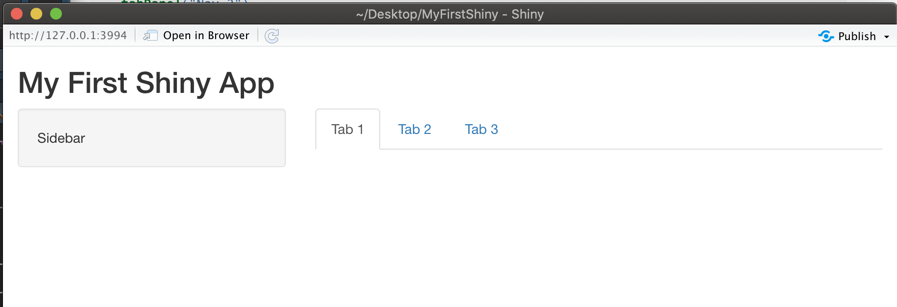

# 版面設定 {#layout}

## 頁面設定函數xxxPage()

為了建構**使用者介面(User Interface)** (前端)，基本的程式碼為: 
```{r eval=F}
fluidPage(
  #input() 輸入元件們
  #,
  #output() 輸出元件們
)
```

其中`fluidPage()`為整合輸入輸出元件的函數為**頁面設定函數**，本章節將介紹建構各種**頁面設定函數**`xxxPage()`的使用方法。

最常見的**頁面設定函數**為範例中的`fluidPage()`，其他頁面設定函數包括`fixedPage()`、`navbarPage()`等，其差異條列如下:

- `fluidPage()`: 頁面會依照瀏覽器的大小自動調整頁面元件的大小與位置，**最常見且建議使用**
- `fixedPage()`: 頁面會固定大小，可搭配`fixedRow()`排版
- `navbarPage()`: 建構有上方選單的頁面，選單可用`tabPanel()`設定
- `bootstrapPage()`: 很會HTML/CSS的使用者可使用此函數，客製化設定頁面
- `fillPage()`: 會生成一個將整個瀏覽器視窗填滿的頁面，只有在特殊情況下才會選用此函數

以`fluidPage()`為例，以下呈現同一程式碼在不同視窗大小的效果：
```{r eval=F}
fluidPage(
  titlePanel("My First fluidPage App"), 
  sidebarLayout( 
    sidebarPanel("Sidebar"), 
    mainPanel("maaaaaaaain page") 
  )
)
```

視窗大小足夠時：

```{r echo=FALSE}

```

視窗縮小時：

```{r echo=FALSE}

```

也因此使用`fluidPage()`時，若使用者用手機或是解析度較差的裝置使用Shiny App，版面會自動調整成適合的樣子，是Shiny App預設且最常用的頁面設定函數。


使用`navbarPage()`則可快速建立有上方選單的網頁，選單可用`tabPanel()`設定，若用子選單，可將多個`tabPanel()`組合成子選單，並用`navbarMenu()`載入

```{r eval=F}
navbarPage(
  title="My First navbarPage App",
  tabPanel("Nav 1"),
  tabPanel("Nav 2"),
  navbarMenu(
    "Sub-Nav",
    tabPanel("Sub-Nav 1"),
    tabPanel("Sub-Nav 2")
  )
)
```

`navbarPage()`範例：

```{r echo=FALSE}

```


## xxxLayout() 和 xxxPanel()

在選擇完適當的頁面設定函數後，可依需求選擇特定**版型(layout)**與**版面(panel)**，通常在**版型(layout)**中，會再使用**版面(panel)**函數做更進一步的設定，當然也可直接在頁面設定函數中直接使用**版面(panel)**函數。最常使用的函數為`titlePanel()`與`sidebarLayout()`，`titlePanel()`用來設定標題，而在`sidebarLayout()`函數中會用`sidebarPanel()`與`mainPanel()`做出有側邊攔與主頁的版型，範例程式碼如下:

```{r eval=F}
fluidPage( #頁面設定函數
  titlePanel("My First Shiny App"), #標題版面(panel)
  sidebarLayout( #版型(layout)
    sidebarPanel("Sidebar"), #側邊欄位版面(panel)
    mainPanel("maaaaaaaain page") #主頁版面(panel)
  )
)
```

使用`titlePanel()`與`sidebarLayout()`所設定的版面如經典的直方圖Shiny範例程式：
```{r echo=FALSE}
knitr::include_graphics("figure/firstEx.png")
```

由範例與名稱可知，`sidebarLayout()`函數可生成**側邊欄位**加上較大**主頁面**的常見版型，也因此`sidebarLayout()`版型函數的必要參數有：
- `sidebarPanel()`：側邊欄位版面
- `mainPanel()` ：主頁版面
另外，可透過`position = "right"`參數調整側邊欄位的位置，預設是左邊

```{r eval=F}
fluidPage( #頁面設定函數
  titlePanel("My First Shiny App"), #標題版面(panel)
  sidebarLayout( #版型(layout)
    position = "right", #調成右邊
    sidebarPanel("Sidebar"), #側邊欄位版面(panel)
    mainPanel("maaaaaaaain page") #主頁版面(panel)
  )
)
```

```{r echo=FALSE}

```

在各版面(panel)函數中，可直接放入輸入輸出元件，若有更複雜的排版需求，如分頁等，就會在`mainPanel()` 主頁版面或其他地方放入更多的版面做進一步的調整，如使用`tabsetPanel()`加入分頁：

```{r eval=F}
fluidPage(
  titlePanel("My First Shiny App"), #標題版面(panel)
  sidebarLayout( #版型(layout)
    sidebarPanel("Sidebar"), #側邊欄位版面(panel)
    mainPanel( #主頁版面(panel)
      tabsetPanel(
        tabPanel("Tab 1"),
        tabPanel("Tab 2"),
        tabPanel("Tab 3")
      )
    ) 
  )
)
```

```{r echo=FALSE}

```

若因所需分頁太多，`tabsetPanel()`無法滿足需求時，`navlistPanel()`是另一個不錯的選項，預設樣式是將選單排在側邊：
```{r eval=F}
fluidPage(
  titlePanel("My First navlistPanel App"),
  navlistPanel(
    tabPanel("Nav 1"),
    tabPanel("Nav 2"),
    tabPanel("Nav 3")
  )
)
```

```{r echo=FALSE}

```

## row 與 column {#row}

在`fluidPage()`中，也可直接使用`fluidRow()`和`column()`函數做行與列的排版，通常會先排列 (row)，再排行 (column)，每行 (column)通常分為**12等分**，若想設定大概頁面四分之一的寬度，則寬度就設為3 (12/4=3)，下列範例特別將各column區塊著色，以方便辨識各column的寬度。

```{r eval=F}
fluidPage(
    titlePanel("Row and Column"),
    fluidRow(
        column(width=3,"3-1", style = "background:yellow;"),#黃色
        column(width=6,"6", style = "background:pink;"),#粉紅色
        column(width=3,"3-2", style = "background:lime;")#綠色
    )
)
```

```{r echo=FALSE}

```

使用上述Page、Layout與Panel等函數，即可將應用程式的使用者介面做系統性的設計。完成各區塊的劃分後，下一步則是在Panel中放置輸入元件 (\@ref(input))與輸出元件 (\@ref(output))。

## 參考資料

- [Learn Shiny](https://shiny.rstudio.com/tutorial/){target="_blank"}
- [Layout the user interface](https://shiny.rstudio.com/tutorial/written-tutorial/lesson2/){target="_blank"}
- [Application layout guide](https://shiny.rstudio.com/articles/layout-guide.html){target="_blank"}