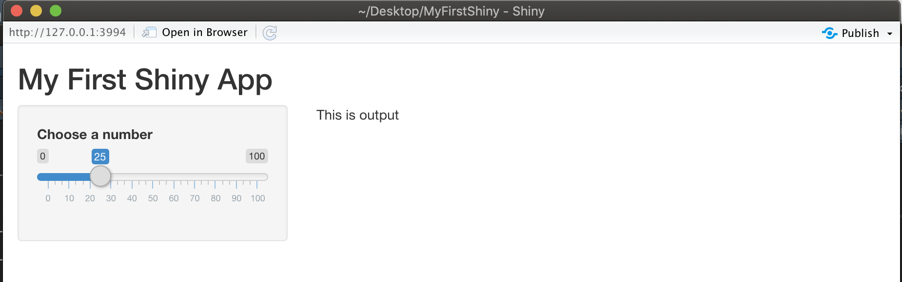

# 輸入Inputs {#input}

為了建構**使用者介面(User Interface)** (前端)，基本的程式碼為: 
```{r eval=F}
fluidPage( #頁面設定函數
  titlePanel("My First Shiny App"), #標題版面(panel)
  sidebarLayout( #版型(layout)
    sidebarPanel(input() 輸入元件們), #側邊欄位版面(panel)
    mainPanel(output() 輸出元件們) #主頁版面(panel)
  )
)
```

若需了解頁面設定函數、版面與版型的使用方式，可參考前一章節 (\@ref(layout))，本章節將介紹建構各種**輸入元件**函數的使用方法。

常見的**輸入元件**函數如下：

1. 選單/選擇系列：

  - `checkboxInput()`:	單一選單
  - `checkboxGroupInput()`:	可多選的選單列表
  - `radioButtons()`:	只可單選的選單列表
  - `selectInput()`:	下拉式選單

2. 輸入系列：

  - `textInput()`:	輸入文字
  - `numericInput()`:	輸入數字
  - `dateInput()`:	數入日期
  - `dateRangeInput()`: 輸入一組日期區間（兩個日期）
  - `sliderInput()`:	可滑動的數字選單，初選值可有一個（0~初選值）或兩個（初選值1~初選值2）
  - `fileInput()`:	檔案上傳
  
3. 顯示系列

  - `helpText()`:	說明文字，樣式會跟一般的文字不同

4. 按鈕系列

  - `submitButton()`:	提交按鈕
  - `actionButton()`:	觸發按鈕

上述輸入元件的顯示結果如下圖 ([圖片來源](https://shiny.rstudio.com/tutorial/written-tutorial/lesson3/){target="_blank"})：

```{r echo=FALSE}
knitr::include_graphics("figure/basic-widgets.png")
```

各種**輸入元件**的共用參數，包括`inputId`、`label`與`...`，分述如下:

- inputId: 為輸入元件的名稱，為每個元件取合理且唯一的名稱，才可在Shiny App程式中取用
- label: 為輸入元件在畫面上呈現的名字，顯示用，因此必須輸入使用者看得懂的說明
- ...: 每個輸入元件會有自己的特殊設定參數，可用`?輸入元件函數名稱`來查詢說明文件

以`sliderInput()`為例，除了`inputId`與`label`外，還需要設定最小值`min`、最大值`max`以及預設數值`value`等三個參數，如以下範例：

```{r eval=F}
fluidPage( #頁面設定函數
  titlePanel("My First Shiny App"), #標題版面(panel)
  sidebarLayout( #版型(layout)
    sidebarPanel( #側邊欄位版面(panel)
      sliderInput( #輸入元件函數
        inputId = "num",
        label ="Choose a number",
        min = 0, max = 100, 
        value =25
      )
    ), 
    mainPanel("This is output") #主頁版面(panel)
  )
)
```

使用上述程式碼所產出的應用程式畫面：

```{r echo=FALSE}

```

若想要查看各項輸入元件的範例程式碼，可至 [Shiny Widgets Gallery](https://shiny.rstudio.com/gallery/widget-gallery.html){target="_blank"}網站查看。

## 參考資料
- [Learn Shiny](https://shiny.rstudio.com/tutorial/){target="_blank"}
- [Add control widgets](https://shiny.rstudio.com/tutorial/written-tutorial/lesson3/){target="_blank"}
