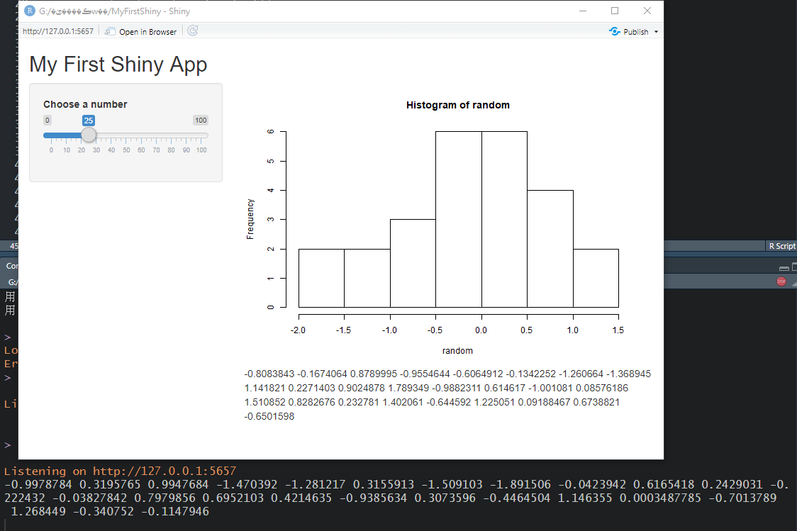

# 伺服器端程式 Server {#server}

Shiny App是由**使用者介面(User Interface)**與**伺服器端程式 (Server Instruction)**組合而成，而server函數中最重要的功能為**產出使用者介面所需的輸出元件(內容)**，本章節將介紹**伺服器端程式**的撰寫方法。

伺服器端程式中有server函數，server函數的格式如下:
```{r eval=F}
server <- function (input,output){
  # 伺服器端程式
  input$checkbox
  output$plot
  # etc..
}
```

從上述程式碼可以發現在server函數中，有兩個固定的參數，分別為`input`與`output`，`input`為使用者介面中所包含的輸入元件，`output`為輸出元件。若須取用特定輸入與輸出相關元件，可使用`input或output$Id`作為取用路徑，如`input$checkbox`，`output$plot`等，`$`錢字號前方指定取用輸入元件`input`還是輸出元件`output`，後方指定元件的`Id`。因此，在使用者介面函數中，**幫各輸入與輸出元件取容易記憶與識別的Id**是很重要的。

## 渲染函數 Render function

為了在server函數產出輸出元件，我們必須使用**渲染函數(Render function)**，渲染函數與輸入輸出函數類似，有固定的格式，通常為`renderXXX()`，`XXX`為**需要呈現的資料/內容格式**，如`Plot`、`Image`、`Table`等，組合成`renderPlot()`、`renderImage()`等函數。渲染函數的輸入參數為一獨立函數，此函數必須使用`{ }`大括號包起來。與撰寫函數一樣，`{ }`大括號中可有無限多行程式碼，以**製作與產生需要呈現的資料/內容**，如直方圖`hist(rnorm(30))`

```{r eval=F}
server <- function (input,output){
  renderPlot( {
    hist(rnorm(30)) 
  } )
}
```

若輸出的圖形/資料會依照輸入資料改變，則需要在渲染函數中取用**輸入元件**，取用方式為`input$Id`，如`input$checkbox`、`input$max_num`等，輸入元件的值會隨著使用者介面的調整而即時變動，承上述範例，我們可以將原數值`30`改為由輸入元件`input$max_num`決定，以達成**互動式**應用程式的效果。
```{r eval=F}
server <- function (input,output){
  renderPlot( {
    hist(rnorm(input$max_num))
  } )
}
```

最後將渲染函數的值指定給輸出元件，如`output$hist<-渲染函數({#一大堆程式碼})`，即完成使用者介面所需的輸出output元件的產出程式。

```{r eval=F}
server <- function (input,output){
  output$hist<-renderPlot( {
    hist(rnorm(input$max_num))
  } )
}
```

完整範例程式碼：

```{r eval=F}
ui <- fluidPage( #頁面設定函數
    titlePanel("My First Shiny App"), #標題版面(panel)
    sidebarLayout( #版型(layout)
        sidebarPanel( #側邊欄位版面(panel)
            sliderInput( #輸入元件函數
                inputId = "max_num",
                label ="Choose a number",
                min = 0, max = 100, 
                value =25
            )
        ), 
        mainPanel(
            plotOutput("hist")
        ) #主頁版面(panel)
    )
)
server <- function (input,output){
  output$hist<-renderPlot( {
    hist(rnorm(input$max_num))
  } )
}
shinyApp(ui = ui, server = server)
```

上述程式程式可達效果：

```{r echo=FALSE}
knitr::include_graphics("figure/render.gif")
```

若想要查看各項輸入元件取值的格式與範例程式碼，可至 [Shiny Widgets Gallery](https://shiny.rstudio.com/gallery/widget-gallery.html){target="_blank"}網站查看。

延續上一章節 (\@ref(output))，常見的輸出元件函數與其對應的**渲染函數**如下：

1. 表格類

  - `dataTableOutput()`: `renderDataTable()`
  - `tableOutput()`:	`renderTable()`

2. 圖片類

  - `imageOutput()`:	`renderImage()`
  - `plotOutput()`:	`renderPlot()`

3. HTML類

  - `htmlOutput()`:	`renderUI()`
  - `uiOutput()`:	`renderUI()`

4. 文字類

  - `textOutput()`:	`renderText()`
  - `verbatimTextOutput()`: `renderText()`

## 反應函數 Reactive function {#reactive}

在使用者介面中，當輸入元件 (如`input$num`)的值改變時，會通知使用該輸入元件的**反應函數**，該反應函數會使用該輸入元件的新值，並做相對應的運算與輸出處理，上個小節介紹的渲染函數為最常見的反應函數。

以渲染函數來說，若輸入元件 (如`input$max_num`)的值改變時，渲染函數`renderPlot({ })`大括號`{ }`中的程式碼會從頭到尾從新執行一次。

```{r eval=F}
renderPlot( {
  ## re-run start
  hist(rnorm(input$max_num))
  ## re-run end
} )
```

### 反應函數 reactive()

在某些狀況中，渲染函數`renderPlot({ })`大括號`{ }`中的程式碼會在server function中出現多次，若每次輸入元件改變時，同樣的程式碼必須執行多次，可能會影響程式效能，此時可用反應函數`reactive()`，將執行結果暫存。

以下是同一系列的程式碼在server function中出現多次的情境，其中`cal<-(input$max_num*100+30)/100   random<-rnorm(cal)`這兩行程式碼會執行多次，若程式碼更長或是更複雜一些，就會顯著的影響效能。

```{r eval=F}
renderPlot( {
  ## re-run start
  cal<-(input$max_num*100+30)/100
  random<-rnorm(cal)
  hist(random)
  ## re-run end
} )
renderText( {
  ## re-run start
  cal<-(input$max_num*100+30)/100
  random<-rnorm(cal)
  random
  ## re-run end
} )
```

除了效能以外，這類程式碼執行多次會有問題，通常我們要同時輸出相同資料的文字與圖片，但在此情境中，`random<-rnorm(cal)`會在`renderPlot()`中執行一次，並在`renderText()`中執行一次，執行兩次`rnorm()`的結果，就是拿來畫圖的資料與文字呈現的資料並非同一組資料。為了證明兩次執行的`rnorm()`結果不同，進而造成圖片與文字使用的資料不同的問題，可參考以下測試程式碼。

完整範例程式碼：

```{r eval=F}
ui <- fluidPage( #頁面設定函數
  titlePanel("My First Shiny App"), #標題版面(panel)
  sidebarLayout( #版型(layout)
    sidebarPanel( #側邊欄位版面(panel)
      sliderInput( #輸入元件函數
        inputId = "max_num",
        label ="Choose a number",
        min = 0, max = 100, 
        value =25
      )
    ), 
    mainPanel(
      plotOutput("hist"),
      textOutput("random")
    ) #主頁版面(panel)
  )
)
server <- function (input,output){
  output$hist<-renderPlot( {
    ## re-run start
    cal<-(input$max_num*100+30)/100
    random<-rnorm(cal)
    cat(random)
    hist(random)
    ## re-run end
  } )
  output$random<-renderText( {
    ## re-run start
    cal<-(input$max_num*100+30)/100
    random<-rnorm(cal)
    random
    ## re-run end
  } )
}
shinyApp(ui = ui, server = server)
```

上述程式碼執行後，畫圖的資料會呈現在console視窗 (節塗黑底部分)，而文字資料則是呈現在Shiny App中 (直方圖下方)，可以發現兩邊的資料是不同的:

```{r echo=FALSE}

```

為了解決上述**相同程式碼執行多次**以及**可能的資料不一致**問題，可用反應函數`reactive()`，將需重複執行的程式碼擷取至反應函數`reactive()`中，並將執行結果儲存至變數`saved_data`中，透過反應函數`reactive()`的設定，當輸入元件改變時，只會重複執行反應函數`reactive()`中的程式碼一次，再依序將執行結果渲染至輸出元件中。要特別注意的地方是在叫用`saved_data`時，必須以函數的方式叫用`saved_data()`。


範例程式碼: 
```{r eval=F}
saved_data<-reactive({
  cal<-(input$max_num*100+30)/100
  random<-rnorm(cal)
  random
} )
renderPlot( {
  hist(saved_data())
} )
renderText( {
  saved_data()
} )
```


為了檢查此時文字與圖片使用資料是否一至，可複製並執行以下完整範例程式碼：

```{r eval=F}
ui <- fluidPage( #頁面設定函數
  titlePanel("My First Shiny App"), #標題版面(panel)
  sidebarLayout( #版型(layout)
    sidebarPanel( #側邊欄位版面(panel)
      sliderInput( #輸入元件函數
        inputId = "max_num",
        label ="Choose a number",
        min = 0, max = 100, 
        value =25
      )
    ), 
    mainPanel(
      plotOutput("hist"),
      textOutput("random")
    ) #主頁版面(panel)
  )
)
server <- function (input,output){
  saved_data<-reactive({
    cal<-(input$max_num*100+30)/100
    random<-rnorm(cal)
    random
  } )
  output$hist<-renderPlot( {
    print(saved_data())
    hist(saved_data())
  } )
  output$random<-renderText( {
    saved_data()
  } )
}
shinyApp(ui = ui, server = server)
```

上述程式碼執行後，畫圖的資料會呈現在console視窗 (節塗黑底部分)，而文字資料則是呈現在Shiny App中 (直方圖下方)，可以發現兩邊的資料此時是一致的:

```{r echo=FALSE}
knitr::include_graphics("figure/shinyRandomReactive.png")
```

適當的使用反應函數`reactive()`可減少相同程式碼的執行次數，也可避免可能的資料不一致問題。

### 不反應 isolate()

`isolate()`
將不需即時反應/重跑程式的輸入元件放入隔離函數`isolate()`中，即可將此輸入元件變成非反應元件，當此輸入元件改變時，程式並不會重跑。此法避免不必要的程式重跑，提升效能與使用者體驗。

```{r eval=F}
isolate(rnorm(input$max_num))
```

### 按鈕觸發 observeEvent()

`observeEvent()`通常搭配`actionButton()`使用，`observeEvent()`的第一個參數為**追蹤的輸入元件**，通常為按鈕，第二個參數則為按鈕點選後**需要執行的程式碼**，當`observeEvent()`中的輸入元件改變時，如點選某個action button，將會觸發後續程式碼的執行，如下列程式碼所示，第一個參數為`input$action`，為`actionButton()`，第二個參數則是將資料放入圖型輸出元件。在程式碼執行時，調整`input$max_num`的值，以及點選`input$action`按鈕，都會觸發圖片更新。

```{r eval=F}
server <- function (input,output){
    observeEvent(input$action, {
        output$hist<-renderPlot( {
            hist(rnorm(input$max_num))
        } )
    })
}
```

完整的可執行程式碼如下: 
```{r eval=F}
library(shiny)

ui <- fluidPage(
  titlePanel("My First Shiny App"), #標題版面(panel)
  sidebarLayout( #版型(layout)
    sidebarPanel( #側邊欄位版面(panel)
      sliderInput( #輸入元件函數
        inputId = "max_num",
        label ="Choose a number",
        min = 0, max = 100, 
        value =25
      ),
      actionButton("action", "點我重畫圖")
    ), 
    mainPanel(
      plotOutput("hist"),
    ) #主頁版面(panel)
  )
)

server <- function (input,output){
    observeEvent(input$action, {
        output$hist<-renderPlot( {
            hist(rnorm(input$max_num))
        } )
    })
}

shinyApp(ui = ui, server = server)

```


由操作執行結果可發現不管是滑動數值或是點選按鈕，都能觸發圖片更新。

```{r echo=FALSE}
knitr::include_graphics("figure/shinyRandomReactive.png")
```


### 延遲反應 eventReactive()

根據上述反應函數的介紹，通常輸入元件改變時，反應函數會即時反應，並改變輸出內容，但有時我們想避免不必要的即時反應，舉例來說，上述使用`observeEvent()`的範例可以實作在**數值更新**以及**點選按鈕**時都更新圖片的網頁，但有時我們希望能在**點選按鈕時才更新網頁**，數值更新時網頁則不做任何變動，此時可使用`eventReactive()`函數實作延遲反應的功能，如下列程式碼所示，`eventReactive()`函數的第一個參數為**按鈕輸入元件**，如`input$action`，第二個參數為按鈕被點選後需要執行的程式碼，通常**包括其他不想要程式即時反應變動的輸入元件**，如`input$max_num`。`eventReactive()`函數的輸出必須存在一變數中，以`randomVals`為例，在渲染函數叫用此變數時，需要用function的方式叫用，如`hist(randomVals())`

```{r eval=F}
server <- function (input,output){
    randomVals <- eventReactive(input$action, {
        rnorm(input$max_num)
    })
    output$hist<-renderPlot( {
        hist(randomVals())
    } )
}
```


完整可執行程式碼如下:
```{r eval=F}
ui <- fluidPage(
    titlePanel("My First Shiny App"), #標題版面(panel)
    sidebarLayout( #版型(layout)
        sidebarPanel( #側邊欄位版面(panel)
            sliderInput( #輸入元件函數
                inputId = "max_num",
                label ="Choose a number",
                min = 0, max = 100, 
                value =25
            ),
            actionButton("action", "點我重畫圖")
        ), 
        mainPanel(
            plotOutput("hist"),
        ) #主頁版面(panel)
    )
)


server <- function (input,output){
    randomVals <- eventReactive(input$action, {
        rnorm(input$max_num)
    })
    output$hist<-renderPlot( {
        hist(randomVals())
    } )
}
shinyApp(ui = ui, server = server)
```


由操作執行結果可發現只有點選按鈕才能觸發圖片更新。

```{r echo=FALSE}
knitr::include_graphics("figure/shinyRandomReactive.png")
```


### reactiveValues()

**撰寫中**

`reactiveValues()` 藉由輸入函數，修改自定義的資料內容，接著觸發反應函數的功能，並更新相對應的輸出

### reactiveTimer()

**撰寫中**

timer `reactiveTimer()`


## 參考資料

- [Learn Shiny](https://shiny.rstudio.com/tutorial/){target="_blank"}
- [Display reactive output](https://shiny.rstudio.com/tutorial/written-tutorial/lesson4/){target="_blank"}