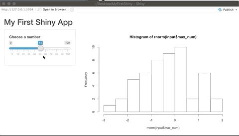
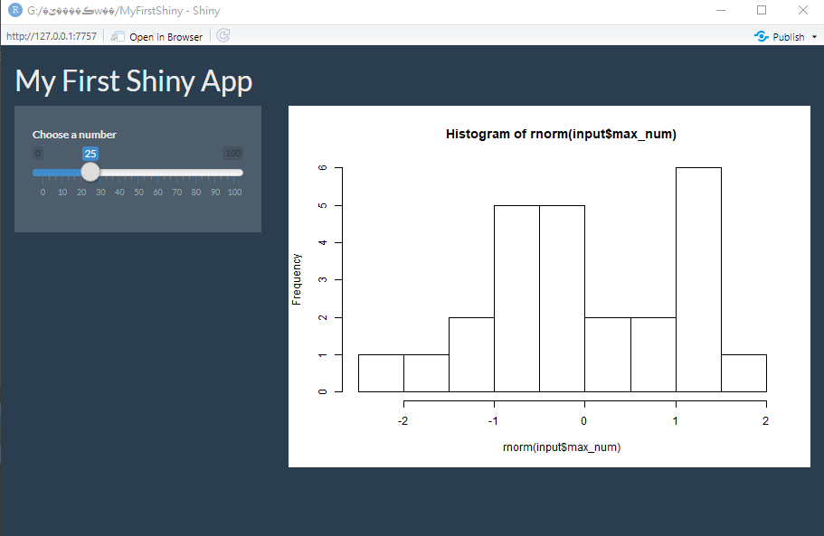
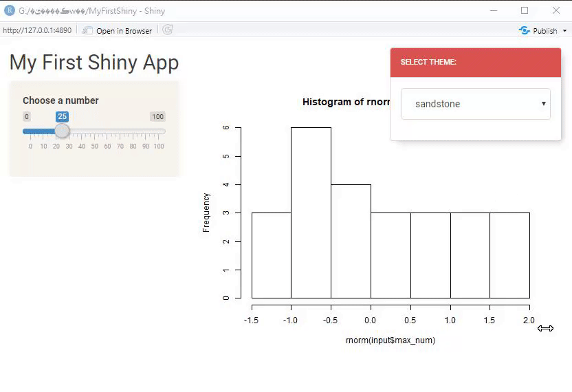

# (PART) 進階內容 {-} 

# 客製化使用者介面 {#design}

在之前的章節，我們透過使用者介面設計 (含輸入 Ch. \@ref(input) 與輸出 Ch. \@ref(output))、伺服器端程式設計 Ch. \@ref(server)以及部屬上線 Ch. \@ref(deploy) 等三個步驟完成Shiny App的製作與上線，但Shiny App也提供許多客製化設定的功能，包括使用者介面 (本章節)，儀表板設計 Ch. \@ref(dashboard)，以及叫用另外的程式碼檔案 Ch. \@ref(script)、JavaScript函式庫 Ch. \@ref(input) 等。此外，我們也可在上線前測試Shiny App的介面與效能 Ch. \@ref(test) ，以免程式效能不佳影響使用者體驗。

## 樣式模板

若想改變Shiny App的外觀，安裝`shinythemes`[@R-shinythemes]套件，可輕鬆的將內建的Bootstrap模板套用在你所開發的Shiny App中，`shinythemes`套件的模板多來自[Boostwatch](https://bootswatch.com/){target="_blank"}網站，可直接去該網站查看所有模板。

要使用`shinythemes`套件，依照R套件的使用原則，第一次使用必須先安裝`install.packages()`再載入`library()`，未來只需再次載入即可
```{r eval=F}
install.packages("shinythemes")
library(shinythemes)
```

在完成`shinythemes`套件的安裝與載入後，即可在Shiny App中套用樣式模板，套用方式是在使用者介面（前端）的頁面設定函數，如`fluidPage()`中，增加一參數`theme = shinytheme("樣式名稱")`，樣式的名稱可在[Boostwatch](https://bootswatch.com/){target="_blank"}網站查看。

以下以**superhero**樣式為例，在使用者介面（前端）`ui`的`fluidPage()`函數中，增加一行`theme = shinytheme("superhero"),`：

```{r eval=F}
ui <- fluidPage( #頁面設定函數
  theme = shinytheme("superhero"),
  titlePanel("My First Shiny App"), #標題版面(panel)
)
```

可執行的完整範例程式碼：

```{r eval=F}
ui <- fluidPage( #頁面設定函數
   theme = shinytheme("superhero"),
    titlePanel("My First Shiny App"), #標題版面(panel)
    sidebarLayout( #版型(layout)
        sidebarPanel( #側邊欄位版面(panel)
            sliderInput( #輸入元件函數
                inputId = "max_num",
                label ="Choose a number",
                min = 0, max = 100, 
                value =25
            )
        ), 
        mainPanel(
            plotOutput("hist")
        ) #主頁版面(panel)
    )
)
server <- function (input,output){
  output$hist<-renderPlot( {
    hist(rnorm(input$max_num))
  } )
}
shinyApp(ui = ui, server = server)
```

在沒增加`theme = shinytheme("superhero"),`之前，原輸出樣式為：

```{r echo=FALSE}

```

加了`theme = shinytheme("superhero"),`參數後的樣式：

```{r echo=FALSE}

```

執行像上述修改為深色基底的程式碼時，會發現圖片還是白底為主，若覺得這樣不妥，可加上`shinyOptions(plot.autocolors=T)`設定，不過這個功能在下個版本才會正式上線。

若無法馬上決定樣式，想更進一步看到各種樣式模板使用後的應用程式外觀，可在UI的頁面設定函數中加上一參數`themeSelector(),`，啟動**樣式選擇器**，當然在使用前也需載入`shinythemes`套件。

在下方可執行的完整範例程式碼中，頁面設定函數`fluidPage()`的第一個參數即為**樣式選擇器**：

```{r eval=F}
ui <- fluidPage( #頁面設定函數
    themeSelector(), # 樣式選擇器
    titlePanel("My First Shiny App"), #標題版面(panel)
    sidebarLayout( #版型(layout)
        sidebarPanel( #側邊欄位版面(panel)
            sliderInput( #輸入元件函數
                inputId = "max_num",
                label ="Choose a number",
                min = 0, max = 100, 
                value =25
            )
        ), 
        mainPanel(
            plotOutput("hist")
        ) #主頁版面(panel)
    )
)
server <- function (input,output){
  output$hist<-renderPlot( {
    hist(rnorm(input$max_num))
  } )
}
shinyApp(ui = ui, server = server)
```


執行上述程式碼即可開啟樣式選擇器: 

```{r echo=FALSE}

```


網路上還有許多套件可讓使用者快速套用已設計好的樣式，如：
- `shinymaterial` : 讓使用者可應用Google's Material design概念與元件，可至[官網](https://ericrayanderson.github.io/shinymaterial/){target="_blank"}查看套用效果
- [RinteRface](https://rinterface.com/){target="_blank"}推出的各種套件，如
`shinyMobile` [GitHub連結](https://github.com/RinteRface/shinyMobile){target="_blank"} : 提供製作適合手機使用的Shiny App模板：

```{r echo=FALSE}

```
[圖片來源](https://rinterface.com/){target="_blank"}

## R -> HTML

**撰寫中**

此部分建議比較熟HTML或是想要學HTML的使用者閱讀。

### HTML 101

### 在R中撰寫HTML
tags

A list of functions

```{r eval=F}
tags$h1()
tags$h2()
tags$a(href="~","book")
<a href="~">"book"</a>
```


www folder


## CSS

**撰寫中**

code cademy css leasson

CSS教材
在Shiny App使用CSS 
1. 使用css file (放在專案資料夾中的www資料夾)
2. 在header中直接撰寫css
3. 在每個tag中分別撰寫css

Tag -> Class -> id

```{r eval=F}
fluidPage(
  theme = "xxx.css"
)
```
```{r eval=F}
fluidPage(
  tags$head(
    rel="stylesheet",
    xx,
    xx
  )
)
```
```{r eval=F}
fluidPage(
  includeCSS("xxx.css") #只要放在專案資料夾就好，不用放在www資料夾中
)
```


### Bootstrap and Sass
CSS framework

`sass`
`bootstraplib`

## 參考資料

- [How to Start Shiny tutorial](https://shiny.rstudio.com/tutorial/){target="_blank"}
- [Shiny Themes](https://rstudio.github.io/shinythemes/){target="_blank"}
- [Styling Shiny apps with Sass and Bootstrap 4 - Joe Cheng](https://resources.rstudio.com/rstudio-conf-2020/styling-shiny-apps-with-sass-and-bootstrap-4-joe-cheng){target="_blank"}
- [shinymaterial](https://ericrayanderson.github.io/shinymaterial/){target="_blank"}
