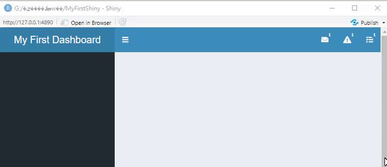
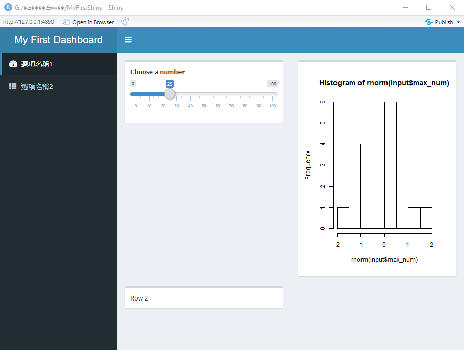
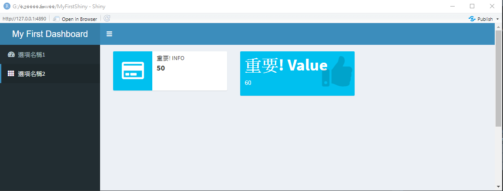

# 儀表板 {#dashboard}

儀表板 (Dashboard)通常是指將資料分析結果，如圖、表與重要的數字等，以單一頁面 (通常是網頁)的方式呈現，目前有許多軟體與服務提供使用者快速的製作自己的儀表板:

- [Power BI](https://powerbi.microsoft.com/zh-tw/){target="_blank"}: 跟微軟的Office軟體整合的很不錯，免費服務包含單機使用或是在公開網路儀表板，若要開發需要帳號密碼授權的儀表板，則需要[付費](https://powerbi.microsoft.com/zh-tw/pricing/)
- [tableau](https://www.tableau.com/zh-tw){target="_blank"}: 應該是最紅的儀表板服務，一樣有免費與付費服務供使用
- [SAS Visual Analytics](https://www.sas.com/zh_tw/software/visual-analytics.html){target="_blank"}
- [QlikView](https://www.qlik.com/us){target="_blank"}

除了上述服務外，當然也可以**使用Shiny App開發儀表板**，Shiny的主要特色就是將資料分析結果轉換成**互動式的網頁應用程式**，簡單來說就是動態網站，因此也很適合做為開發儀表板的工具。跟上述服務不同的是，要Shiny App需要學習R語言，也須學習Shiny App的開發方式，相較於拖拉式的服務，入門稍微困難一些，但也增加了許多彈性。

## 開發儀表板步驟

在開始用Shiny開發儀表板前，建議先完成以下3個步驟:

1. **釐清設計儀表板的目的**: 儀表板的設計通常與需達成的目的有關，如幫助商業決策、監控工廠訂單、以及監控傳染病等，因此在設計儀表板前，建議先將目標訂定清楚，再開始動工。
2. **設定目標對象**: 是否有特定的目標，若特定目標過去已有看類似報表的習慣，呈現分析結果的方式是什麼? 如果目標為一般人，可能沒有足夠的背景知識，圖表複雜度與說明文字的配置則需要多做考慮。
3. **了解使用方式**: 是否都用電腦看? 還是用平板或是手機? 如果用電腦看，通常螢幕大概多大? 是否會用投影的方式在會議中呈現? 以上幾個問題會影響版面設計，以及字型大小等，建議先釐清。

完成上述步驟後，即可開始開發儀表板，而用Shiny開發儀表板大多遵循下列4個步驟:

1. 將須呈現的**資料載入儀表板**

如何**快速的將資料載入**是設計儀表板必須解決的問題，若資料載入時間太久，通常分析也會很慢，會降低使用者體驗，因此，若需要分析的資料很大，可考慮用批次的方式，撰寫其他程式先作預處理，降低資料量，以加快資料存取速度。資料匯入的方式與一般R程式相同，可參考[資料科學與R語言 - 資料讀取與匯出章節](https://yijutseng.github.io/DataScienceRBook/io.html){target="_blank"}。一般分為以下幾種情境:

- 讀取資料庫: 可用`DBI` 套件
- 讀取檔案: 可用`readr` 套件，可參考[資料科學與R語言 - 資料讀取與匯出章節](https://yijutseng.github.io/DataScienceRBook/io.html){target="_blank"}
- 透過API載入: 可用`jsonlite`, `readr`, 或是`xml2`套件，可參考[資料科學與R語言 - 透過API讀取資料章節](https://yijutseng.github.io/DataScienceRBook/io.html#api){target="_blank"}

2. **資料處理分析**

3. **資料呈現**

資料呈現可能有以下方式:

- 數字與文字: `renderText()`
- 表格: `renderTable()`, `DT`套件支援互動式表格
- 圖片: `renderPlot()`
- 地圖: `ggmap`套件，或是`leaflet`套件支援互動式地圖

4. 增加**互動性**

使用先前介紹的輸入元件\@ref(input)，讓使用者調整輸入值，作為改變輸出圖表的依據。以開發新冠肺炎案例數呈現的儀表板為例，可能可以讓使用者用下拉選單選擇呈現國家、用check box選擇區域、或是用slider選擇特定時間區間等。


## 儀表板樣式設計

使用`shinydashboard`[@R-shinydashboard]套件，使用者可快速製作像**儀表板**的Shiny App，因原理與基本架構都是使用Shiny，程式的基本架構與Shiny App相同，包含**使用者介面(User Interface)**與**伺服器端程式 (Server Instruction)**兩個部分。使用`shinydashboard`套件，也須在第一次使用前安裝，之後則執行載入即可。

```{r eval=F}
install.packages("shinydashboard")
library(shinydashboard)
```


### dashboardPage()

比較特別的是，在**使用者介面(User Interface)**中，通常會使用`dashboardPage()`函數建構，而非常見的`fluidPage()`函數。

```{r eval=F}
ui <- dashboardPage(
  #使用者介面程式
)
```

Shiny Dashboard的標準架構包括儀表板標頭 (header) `dashboardHeader()`、側邊選單 (sidebar) `dashboardSidebar()` 以及主頁面 (body) `dashboardBody()` 等三個部分，可依序將此三部分分別輸入在`dashboardPage()`函數中。
```{r eval=F}
ui <- dashboardPage(
  dashboardHeader(),
  dashboardSidebar(),
  dashboardBody()
)
```


比較複雜的應用程式，也可使用下列方式撰寫儀表板架構:

```{r eval=F}
header <- dashboardHeader()
sidebar <- dashboardSidebar()
body <- dashboardBody()

ui <- dashboardPage(header, sidebar, body)
```

### 標頭

`dashboardHeader()`維儀表板儀表板標頭，可在標頭中用`title`參數設定儀表板標題，如下列程式碼所示:

```{r eval=F}
ui <- dashboardPage(
  dashboardHeader(title="My First Dashboard"),
  dashboardSidebar(),
  dashboardBody()
)
```

除了標題外，標頭部分還可使用`dropdownMenu()`加入其他選單，常見的元件有:

- 訊息選單 `messageItem()`
- 通知選單 `notificationItem()`
- 工作選單 `taskItem()`

可分別在畫面右上角加入選單資訊，在`dropdownMenu()`中，可用`type`設定右上角選單呈現的icon，並對應上述三個常見的元件，三個元件各有特定參述可供設定，可依需求選用，比較特別的是在工作選單中可設定每個工作的進度。

```{r eval=F}
ui <- dashboardPage(
    dashboardHeader(title="My First Dashboard",
                    dropdownMenu(type = "messages",
                        messageItem(
                            from = "訊息來源",
                            message = "訊息內容")
                    ),
                    dropdownMenu(type = "notifications",
                        notificationItem(
                        text = "通知通知",
                        icon("users"))
                    ),
                    dropdownMenu(type = "tasks",
                        taskItem(value = 90, 
                                 color = "green","工作進度")
                    )
    ),
    dashboardSidebar(),
    dashboardBody()
)
```


右上角加入選單資訊呈現方式如下圖:

```{r echo=FALSE}

```


若想在後端修改選單元件，則需使用`dropdownMenuOutput()`設定輸出元件，並在伺服器端程式用`renderMenu()`作動態設定。

前端範例:
```{r eval=F}
ui <- dashboardPage(
    dashboardHeader(title="My First Dashboard",
                    dropdownMenuOutput("msg_menu"),
                    dropdownMenuOutput("tsk_menu")
    ),
    dashboardSidebar(),
    dashboardBody()
)
```

後端範例:
```{r eval=F}
server<-function(input,output){
  output$msg_menu <- renderMenu({
    dropdownMenu(type = "messages",
                        messageItem(
                            from = "訊息來源",
                            message = "訊息內容")
                    )
   })
  output$tsk_menu <- renderMenu({
    dropdownMenu(type = "tasks",
                        taskItem(value = 90, 
                                 color = "green","工作進度")
                    )
   })
}
```

會得到類似的輸出結果。

若不需要標頭，也可將標頭關掉:

```{r eval=F}
ui <- dashboardPage(
  dashboardHeader(disable = TRUE),
  dashboardSidebar(),
  dashboardBody()
)
```

### 側邊欄位

而側邊欄位`dashboardSidebar()`可由選單`sidebarMenu()`組成，每個選單`sidebarMenu()`中可有多個選項`meunItem()`，在選項中除可在第一個參數設定選項名稱外，也必須用`tabName`參數設定選項ID，以及`icon`參數加上圖示，幫助使用者理解內容，選項ID的功能是用來對應主頁面`dashboardBody()`的內容。可用的icon可見 [Font-Awesome](http://fontawesome.io/icons/){target="_blank"} 以及 [Glyphicons](http://getbootstrap.com/components/#glyphicons){target="_blank"}兩個網站。

```{r eval=F}
ui <- dashboardPage(
  dashboardHeader(title="My First Dashboard"),
  dashboardSidebar( # 側邊欄位
    sidebarMenu( # 選單
      menuItem("選項名稱1", tabName = "id_1", 
               icon = icon("dashboard")),# 選項1
      menuItem("選項名稱2", tabName = "id_2", 
               icon = icon("th"))# 選項2
    )
  ),
  dashboardBody()
)
```

若不需要側邊欄位，也可將側邊欄位關掉:

```{r eval=F}
ui <- dashboardPage(
  dashboardHeader(title="My First Dashboard"),
  dashboardSidebar(disable = TRUE),
  dashboardBody()
)
```

### 主頁面

主頁面`dashboardBody()`則是使用`tabItems()`來排版，在`tabItems()`中可用多個`tabItem()`來對應側邊欄位的每個選項，對應方式為設定相同的`tabName`，而在`tabItems()`中，再使用列`fluidRow`和欄位`column`或是資訊區塊`box`的方式將圖表排版。排版可參考Ch. \@ref(row)

```{r eval=F}
ui <- dashboardPage(
  dashboardHeader(title="My First Dashboard"),
  dashboardSidebar( # 側邊欄位
    sidebarMenu( # 選單
      menuItem("選項名稱1", tabName = "id_1", 
               icon = icon("dashboard")),# 選項1
      menuItem("選項名稱2", tabName = "id_2", 
               icon = icon("th"))# 選項2
    )
  ),
  dashboardBody(
        tabItems( 
            tabItem(tabName = "id_1", # 對應選項1
                    fluidRow(
                        box(sliderInput( 
                            inputId = "max_num",
                            label ="Choose a number",
                            min = 0, max = 100, 
                            value =25)),
                        box(plotOutput("hist"))
                        ),
                    fluidRow(box("Row 2"))
                    ),
            tabItem(tabName = "id_2", # 對應選項2
                    h2("第二頁")
                    )  
        )
    )
)
```

呈現的效果如下所示:

```{r echo=FALSE}

```

若有較重要的資訊，需要放在顯眼的地方，且有較特別的樣式，可用`infoBox()`和`valueBox()`呈現，這兩個Box的功能差不多，只是樣式稍有不同。

```{r eval=F}
ui <- dashboardPage(
  dashboardHeader(title="My First Dashboard"),
  dashboardSidebar( # 側邊欄位
    sidebarMenu( # 選單
      menuItem("選項名稱1", tabName = "id_1", 
               icon = icon("dashboard")),# 選項1
      menuItem("選項名稱2", tabName = "id_2", 
               icon = icon("th"))# 選項2
    )
  ),
  dashboardBody(
        tabItems( 
            tabItem(tabName = "id_1", # 對應選項1
                    fluidRow(
                        box(sliderInput( 
                            inputId = "max_num",
                            label ="Choose a number",
                            min = 0, max = 100, 
                            value =25)),
                        box(plotOutput("hist"))
                        ),
                    fluidRow(box("Row 2"))
                    ),
            tabItem(tabName = "id_2", # 對應選項2
                    infoBox("重要資訊! Info", 50, icon = icon("credit-card")),
                    valueBox("重要資訊! Value", 60, icon = icon("thumbs-up"))
                    )  
        )
    )
)
```

呈現的效果如下所示:

```{r echo=FALSE}

```


## 參考資料

- [shinydashboard](https://rstudio.github.io/shinydashboard/){target="_blank"}
- [Dynamic Dashboards with Shiny](https://resources.rstudio.com/vimeo-webinars/dynamic-dashboards-with-shiny){target="_blank"}
