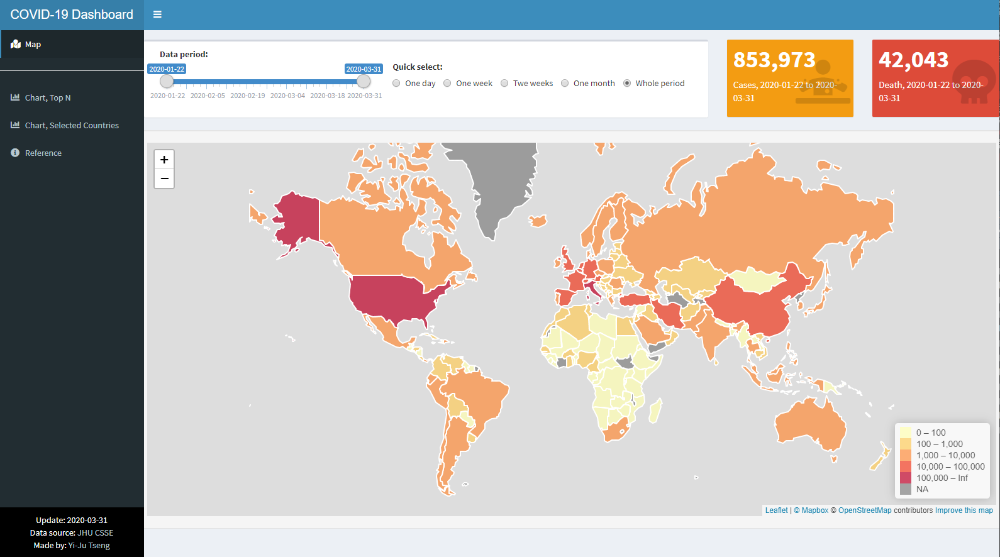
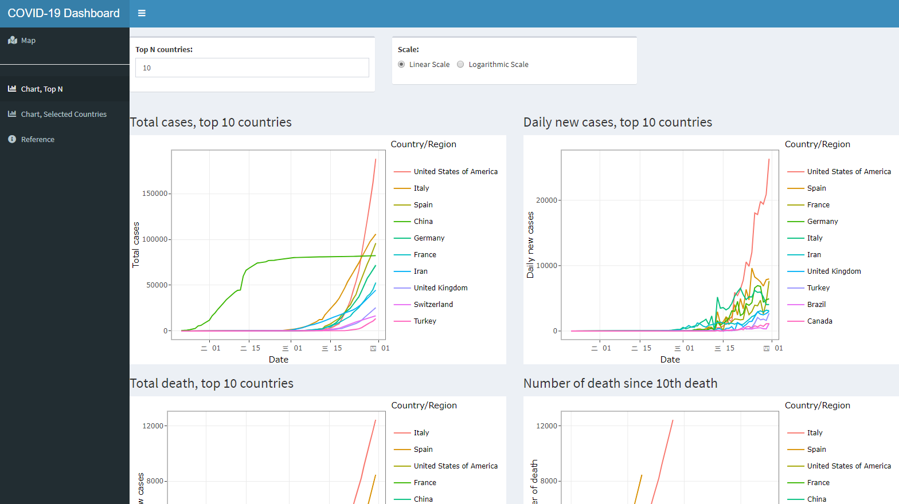
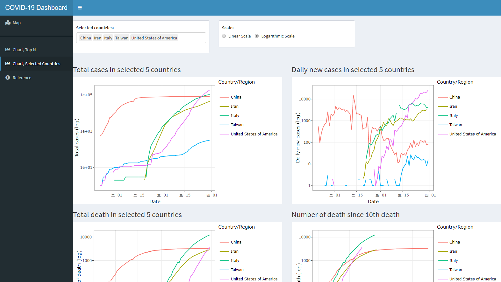

# 新冠肺炎儀表板範例 {#covid19}

儀表板Demo網址: http://shiny.yjtseng.info/content/18/

本章節以2019年末至2020年的新冠肺炎 (COVID-19)流行趨勢儀表板作為Shiny App的開發與應用範例。本範例包括三個主要分頁，**流行地圖**、**案例數、死亡數較多的的國家圖表**以及**所選國家圖表**，畫面如下所示：

地圖：
```{r echo=FALSE}

```

排名前N名的國家圖表：
```{r echo=FALSE}

```

自選國家圖表：
```{r echo=FALSE}

```


以下章節會拆解此Shiny App的原始碼，分段講解如何開發此新冠肺炎 (COVID-19)流行趨勢儀表板，建議先看完前幾個章節後，再閱讀此範例解說，會比較清楚。

## 儀表板主要架構

此儀表板直接使用`shinydashboard`[@R-shinydashboard]套件開發，在使用者介面端，使用預設頁面設定函數`dashboardPage()`建構，函數中包括儀表板標頭 (header) `dashboardHeader()`、側邊選單 (sidebar) `dashboardSidebar()` 以及主頁面 (body) `dashboardBody()` 等三個部分。

- **儀表板標頭 (header)** `dashboardHeader()`並未作太特殊的設定
- **側邊選單 (sidebar)** `dashboardSidebar()`中包含四個選單，分別是**流行地圖** `map_tab`、**案例數、死亡數較多的的國家圖表** `chart_top_tab`、**所選國家圖表** `chart_sel_tab`以及**參考資料** `ref_tab`
- **主頁面 (body)** `dashboardBody()` 則是對應側邊欄位的四個選單，分別設定四個`tabItem`，並用`fluidRow()`排版，因此部分內容較多，**~code code code~**部分程式碼在後方章節說明

主要架構如下方程式碼: 

```{r eval=FALSE}
ui <- dashboardPage(
    ########################################################################################
    # UI Header, simple header
    ########################################################################################
    dashboardHeader(title="COVID-19 Dashboard"),
    ########################################################################################
    # UI Sidebar
    ########################################################################################
    dashboardSidebar(
        sidebarMenu(
            menuItem("Map", tabName = "map_tab", 
                     icon = icon("map-marked")),
            hr(),
            menuItem("Chart, Top N", tabName = "chart_top_tab", 
                     icon = icon("chart-bar")),
            menuItem("Chart, Selected Countries", tabName = "chart_sel_tab", 
                     icon = icon("chart-bar")),
            menuItem("Reference", tabName = "ref_tab", 
                     icon = icon("info-circle"))
        )
    ),
    ########################################################################################
    # UI Body, style setting and tabItems with 4 tabItem (match menu)
    ########################################################################################
    dashboardBody(
        fluidRow(
            tabItems(
                tabItem("map_tab",fluidRow(~code code code~)),
                tabItem("chart_top_tab",fluidRow(~code code code~)),
                tabItem("chart_sel_tab",fluidRow(~code code code~)),
                tabItem("ref_tab",fluidRow(~code code code~))
            )
        )
    )
)
```

## 流行地圖 UI

```{r echo=FALSE}

```

由上圖可知，此流行地圖是由一個日期的滑動軸`sliderInput`、單選選單`radioButtons`、兩個數值方塊`uiOutput`以及最重要的地圖`leafletOutput`所組成。

以下方簡化過的程式碼做說明，首先用兩個`fluidRow`將上方選單與案例數值區塊與下方地圖區塊分開，**上方區塊**先使用一個`box`以及兩個`uiOutput`排版，`box`的寬度為8，兩個`uiOutput`的寬度各為2，留在伺服器端程式設定，相加起來 (8+2+2=12)為12。`box`中放置兩個`column`排版，分別放入日期的滑動軸`sliderInput`以及單選選單`radioButtons`，寬度各為5和7，一樣加起來要是12。**下方區塊**則相較單純，只用了`wellPanel`排版，並放入`leafletOutput`顯示地圖。

```{r eval=FALSE}

ui <- dashboardPage(
    dashboardBody(
        fluidRow(
            tabItems(
                tabItem("map_tab",
                        # info above map
                        fluidRow(
                            # box with slider and radio buttom for period selection
                            box(column(sliderInput(~code code code~),
                                       width=5,offset=0.5),
                                column(radioButtons(~code code code~),
                                       width=7),
                                width=8),
                            # 2 value boxes with case and death number
                            uiOutput("total_case"),
                            uiOutput("total_death")
                        ),
                        # map
                        fluidRow(wellPanel(leafletOutput("case_map")))
                ), # tabItem 1 (map) end 
                tabItem("chart_top_tab",~code code code~), # tabItem 2 (top N chart)  
                tabItem("chart_sel_tab",~code code code~), # tabItem 3 (selected countries chart)  
                tabItem("ref_tab",~code code code~) # tabItem 4 (reference)  
            )
        )
    )
)
```


完整的程式碼如下:

```{r eval=FALSE}

ui <- dashboardPage(
    dashboardBody(
        fluidRow(
            tabItems(
                tabItem("map_tab",
                        # info above map
                        fluidRow(
                            # box with slider and radio buttom for period selection
                            box(column( 
                                sliderInput("period",
                                            "Data period:",
                                            min = min(covid_country_long$Date),
                                            max = max(covid_country_long$Date),
                                            value=c(min(covid_country_long$Date),
                                                    max(covid_country_long$Date)),
                                            timeFormat="%Y/%m/%d"),
                                width=5,offset=0.5),
                                column(
                                    radioButtons("period_quick",label = "Quick select:",
                                                 choices = list("One day" = 1,
                                                                "One week" = 2, 
                                                                "Twe weeks" = 3,
                                                                "One month" = 4, 
                                                                "Whole period" = 5), 
                                                 selected = 5, inline = T),
                                    width=7,style="padding:20px;"),
                                width=8),
                            # 2 value boxes with case and death number
                            uiOutput("total_case"),
                            uiOutput("total_death")
                        ),
                        # map
                        fluidRow(wellPanel(leafletOutput("case_map")))
                ), # tabItem 1 (map) end 
                tabItem("chart_top_tab",~code code code~), # tabItem 2 (top N chart) end 
                tabItem("chart_sel_tab",~code code code~), # tabItem 3 (selected countries chart) end 
                tabItem("ref_tab",~code code code~) # tabItem 4 (reference) end 
            )
        )
    )
)
```

互動式地圖執行畫面：

```{r echo=FALSE}
knitr::include_graphics("figure/map_demo.gif")
```

## 各國圖表 UI

因各國圖表的介面設計差不多，以下以**自選國家圖表**頁面`chart_sel_tab`為例，說明UI安排方式，其它部分程式碼則簡化以方便說明。

自選國家圖表：

```{r echo=FALSE}

```

由上圖可知，本頁面由上方國家複選框`selectizeInput`、調整是否將數字做指數轉換的單選選單`radioButtons`以及下方共四個折線圖組成。

以下方簡化過的程式碼做說明，首先用三個`fluidRow`將上方選單曲塊與下方折線圖(兩兩一組)區塊分開，**上方區塊**先使用兩個`box`排版，`box`的寬度均為4，相加起來並非12，剩下的區塊(6)留著未來擴充用。第一個`box`中放入國家多選的輸入框`selectizeInput`，第二個`box`放入調整指數轉換的單選選單`radioButtons`。**下方兩個區塊**則分別用兩個`column`排版，每個`column`放入一個標題`htmlOutput`以及一個圖`plotlyOutput`。

```{r eval=FALSE}

ui <- dashboardPage(
    dashboardBody(
        fluidRow(
            tabItems(
                tabItem("map_tab",~code code code~), # tabItem 1 (map)  
                tabItem("chart_top_tab",~code code code~), # tabItem 2 (top N chart)  
                tabItem("chart_sel_tab",
                        fluidRow(
                            box(selectizeInput("country_select", "Selected countries:",
                                               unique(covid_country_long$`Country/Region`), 
                                               selected = c("Taiwan","China","Iran","Italy",
                                                            "United States of America"), 
                                               multiple = T,
                                               options = NULL),
                                width=4),
                            box(radioButtons("log_sel",label = "Scale: ",
                                             choices = list("Linear Scale" = 1,
                                                            "Logarithmic Scale" = 2), 
                                             selected = 1, inline = T),
                                width=4)
                        ),
                        fluidRow(column(htmlOutput("country_text"),
                                        plotlyOutput("case_plot_country"),
                                        width=6),
                                 column(htmlOutput("country_new_text"),
                                        plotlyOutput("newcase_plot_country"),
                                        width=6)),
                        fluidRow(column(htmlOutput("country_death_text"),
                                        plotlyOutput("death_plot_country"),
                                        width=6),
                                 column(htmlOutput("country_epi_text"),
                                        plotlyOutput("epi_plot_country"),
                                        width=6)),
                        # info tables
                        htmlOutput("country_table_text"),
                        fluidRow(wellPanel(DTOutput("table_country")))
                ), # tabItem 3 (selected countries chart) end 
                tabItem("ref_tab",~code code code~) # tabItem 4 (reference) end 
            )
        )
    )
)
```


互動式圖表執行畫面：

```{r echo=FALSE}
knitr::include_graphics("figure/curve_demo.gif")
```


## 伺服器端程式

本儀表板伺服器端程式共可分四個部分，分別是**UI文字設定**、**UI圖表設定**、**更新圖表的反應函數**以及**偵測輸入元件改變以更新資料的反應函數**，此部分程式碼均須放在`server function`內，為解說方便，省略`server<-function(input,output, session){ }`

### UI文字設定

在**UI文字設定**中，將程式碼粗略分成:

1. **Footer註腳**中的最新更新日期設定
2. **圖表標題**隨使用者操作動態更新
3. **個案數與死亡人數**隨使用者選擇區間動態計算更新

若儀表板文字不會隨著使用者操作而變動，通常會在UI前端程式就設定好文字內容，如此範例儀表板的Reference參考資料部分，但若想要讓文字可隨著使用者操作或是資料自動更新，就須在伺服器端程式設定。

首先在**Footer註腳**部分，因更新日期要隨著資料更新而改變文字，意即使用資料的最新（最大）日期，因此在伺服器端設定，此處使用彈性較大的`renderUI()`搭配可使用HTML標籤的`tagList()`做設計與排版。

```{r eval=FALSE}
### Footer
output$update<-renderUI(tagList(
  paste0("Update: ",max(covid_country_long$Date)),
  br(),
  "Data source:",
  a(href="https://github.com/CSSEGISandData/COVID-19","JHU CSSE",target="_blank"),
  br(),
  "Made by:",
  a(href="https://yjtseng.info","Yi-Ju Tseng",target="_blank"),
)
)
```

**圖表的標題**也希望可隨著使用者選擇國家數量做變動，如果選案例數前5名的國家，或是自選了6個國家等，都會直接在標題更新，此處一樣使用`renderUI()`作標題文字設定。

```{r eval=FALSE}

### Plot Title
output$topN_text<-
  renderUI(h3(paste("Total cases, top",input$topN,"countries")))
output$topN_new_text<-
  renderUI(h3(paste("Daily new cases, top",input$topN,"countries")))
output$country_text<-
  renderUI(h3(paste("Total cases in selected ",length(input$country_select))," countries"))
output$country_new_text<-
  renderUI(h3(paste("Daily new cases in selected ",length(input$country_select))," countries"))
output$country_text_t<-
  renderUI(h3(paste("Total cases in",input$country,", table")))
output$topN_death_text<-
  renderUI(h3(paste("Total death, top",input$topN,"countries")))
output$country_death_text<-
  renderUI(h3(paste("Total death in selected ",length(input$country_select))," countries"))
output$country_death_text_t<-
  renderUI(h3(paste("Total death in",input$country,", table")))
output$topN_epi_text<-
  renderUI(h3(paste("Number of death since 10th death")))
output$country_epi_text<-
  renderUI(h3(paste("Number of death since 10th death")))
output$country_epi_text_t<-
  renderUI(h3(paste("Number of death since 10th death")))

```

最後則是地圖上**個案數與死亡人數**的數值文字，希望隨著使用者所選區間更新，使用`renderUI()`加上`valueBox()`設定，未使用`renderValueBox()`是因為`renderValueBox()`沒有設定寬度的功能，均使用預設寬度4，這個功能開發者可能未來會修正，因此使用較麻煩的`renderUI()`加上`valueBox()`方式，將寬度設為2。


```{r eval=FALSE}
### valueBox
output$total_case <- renderUI ({
  valueBox(
    value=format(sum(world_case_dym()@data$NewCaseTotal,na.rm=T), big.mark=","), 
    subtitle=paste0("Cases, ",input$period[1]," to ",input$period[2]), 
    icon = icon("diagnoses", lib = "font-awesome"),
    color = "yellow",width=2
  )
})
output$total_death <- renderUI ({
  valueBox(
    value=format(sum(world_case_dym()@data$NewDeathTotal,na.rm=T), big.mark=","), 
    subtitle=paste0("Death, ",input$period[1]," to ",input$period[2]), 
    icon = icon("skull", lib = "font-awesome"),
    color = "red",width=2
  )
})

```

### UI圖表設定

在**UI圖表設定**中，將程式碼粗略分成:

1. **日期選擇的slider**與日期區間快速選單連動
2. **地圖**設定更新
3. **圖片**更新
4. **表格**更新


為了分析疫情方便，儀表板中使用RadioButton設計了**日期區間快速選單**，讓想看單月或是單週狀況的使用者可以不用慢慢拉日期slider，此步驟可以用RadioButton連動地圖，或是RadioButton連動日期Slider，再由日期Slider連動地圖更新，為了使畫面資訊統一，避免日期快速選單資訊與日期選擇slider資訊不一致 (例如slider是全時，但快速選單是一週)，本儀表板選擇使用RadioButton連動日期Slider，再由日期Slider連動地圖更新。此處更新slider使用`observeEvent()`追蹤RadioButton日期區間快速選單的變化，若偵測到改變，則執行一連串的`ifelse`，並使用內建的`updateSliderInput()`更新日期Slider。

```{r eval=FALSE}

## slider auto update
observeEvent(input$period_quick, {
  if(input$period_quick=="1"){
    updateSliderInput(session, "period", value = c(max(covid_country_long$Date),
                                                   max(covid_country_long$Date)))
  }else if(input$period_quick=="2"){
    updateSliderInput(session, "period", value = c(max(covid_country_long$Date)-7,
                                                   max(covid_country_long$Date)))
  }else if(input$period_quick=="3"){
    updateSliderInput(session, "period", value = c(max(covid_country_long$Date)-14,
                                                   max(covid_country_long$Date)))
  }else if(input$period_quick=="4"){
    updateSliderInput(session, "period", value = c(max(covid_country_long$Date)-30,
                                                   max(covid_country_long$Date)))
  }else if(input$period_quick=="5"){
    updateSliderInput(session, "period", value = c(min(covid_country_long$Date),
                                                   max(covid_country_long$Date)))
  }
})
```

**疫情地圖**套用開源的Leaflet地圖，更新與設計直接使用`renderLeaflet()`功能，使用`addPolygons()`將地圖的國家邊界畫出來，並設定使用案例數著色`fillColor = ~pal(NewCaseTotal)`，當滑鼠游標滑過時，使用`highlight = highlightOptions()`將該國邊界顏色改變，以凸顯游標所在國家，同時使用`label = ~lab`設定彈出資訊視窗的內容，`~lab`內容的設計在資料產出時即完成，會在後面章節介紹。最後使用`addLegend()`加上圖標，讓使用者判斷每個顏色對應的案例數，以及用`setView`設定地圖載入時的預設中心位置和地圖大小。

```{r eval=FALSE}
## map output components setting
output$case_map<-renderLeaflet({
  #world_case period.....
  leaflet(world_case_dym())  %>%
    addProviderTiles("MapBox", 
                     options = providerTileOptions(
                       id = "mapbox.light",
                       accessToken = Sys.getenv('MAPBOX_ACCESS_TOKEN')))%>% 
    addPolygons(
      fillColor = ~pal(NewCaseTotal),
      weight = 2,
      opacity = 1,
      color = "white",
      dashArray = "1",
      fillOpacity = 0.7,
      highlight = highlightOptions(
        weight = 1,
        color = "#666",
        dashArray = "",
        fillOpacity = 0.7,
        bringToFront = TRUE),
      label = ~lab,
      labelOptions = labelOptions(
        style = list("font-weight" = "normal", padding = "3px 8px"),
        textsize = "15px",
        direction = "auto")
    ) %>% 
    addLegend(pal = pal, values = ~NewCaseTotal, opacity = 0.7, title = NULL,
              position = "bottomright") %>%
    setView(0, 25, zoom=2)
  
})
```

**案例圖**部分使用Plotly函式庫提供的互動式圖形功能，分為排名前幾名的圖表以及自選國家圖表，各四個圖形。設定直接使用`renderPlotly()`功能搭配`ggplotly()`將ggplot圖表帶入，ggplot圖表部分在後端使用反應函數生成，提高程式碼易讀性。

```{r eval=FALSE}
## plot output components setting
output$case_plot_top10<- renderPlotly(
  ggplotly(plot_topN_data())
)
output$newcase_plot_top10<- renderPlotly(
  ggplotly(plot_topN_new_data())
)
output$death_plot_top10<- renderPlotly(
  ggplotly(plot_topN_death_data())
)
output$epi_plot_top10<- renderPlotly(
  ggplotly(plot_topN_epi_data())
)

output$case_plot_country<- renderPlotly(
  ggplotly(plot_country_case_data()) 
) 
output$newcase_plot_country<- renderPlotly(
  ggplotly(plot_country_newcase_data()) 
)
output$death_plot_country<- renderPlotly(
  ggplotly(plot_country_death_data()) 
)
output$epi_plot_country<- renderPlotly(
  ggplotly(plot_country_epi_data()) 
)
```

**案例數表格**部分使用`DT`函式庫實現動態排序與搜尋功能，直接使用`renderDT()`功能將表格輸入即可。表格整理相關dplyr函數可參考[dplyr教學](https://yijutseng.github.io/DataScienceRBook/eda.html#dplyr){target="_blank"}。

```{r eval=FALSE}
## table output components setting
output$table_country<-renderDT(
  covid_country %>% ungroup() %>%
    filter(`Country/Region` %in% input$country_select) %>%
    select(`Country/Region`,date,Total_case_num,New_case_num,
           Total_death_num,New_death_num) %>%
    rename(Date=date,`Total case number`=Total_case_num,
           `New case number`=New_case_num,
           `Total death number`=Total_death_num,
           `New death number`=New_death_num),
  filter = 'top', server = TRUE,
  options = list(pageLength = 10, 
                 autoWidth = TRUE,
                 searching = TRUE),
  rownames= FALSE
)
```


### 更新圖片的反應函數

**更新圖片的反應函數**共有八個，設計大同小異，使用`reactive()`函數追蹤是否要將數值取log的輸入元件變化，並使用ggplot製作折線圖，ggplot的使用可參考[ggplot教學](https://yijutseng.github.io/DataScienceRBook/vis.html#ggplot2%E7%B0%A1%E4%BB%8B){target="_blank"}。若值取log的輸入元件有改變，則重新作圖，並依照使用者的選擇決定是否要加上ggplot內建製作log圖表`scale_y_log10()`功能。

```{r eval=FALSE}
## reactive plot
plot_topN_data<-reactive({
  p<-ggplot(topN_data())+
      geom_line(aes(x=Date,y=`Case number`,color=`Country/Region`))+
      theme_bw()
  
  if(input$log_top=="2"){
    p+labs(x="Date",y="Total cases (log)")+
      scale_y_log10()
  }else{
    p+labs(x="Date",y="Total cases")
  }
  
} )
plot_topN_new_data<-reactive({
  p<-ggplot(topN_new_data())+
      geom_line(aes(x=Date,y=`Case number`,color=`Country/Region`))+
      theme_bw()
  if(input$log_top=="2"){
    p+
      labs(x="Date",y="Daily new cases (log)")+
      scale_y_log10()
  }else{
    p+
      labs(x="Date",y="Daily new cases")
  }
  
} )
plot_topN_death_data<-reactive({
  p<-ggplot(topN_death_data())+
      geom_line(aes(x=Date,y=`Case number`,color=`Country/Region`))+
      theme_bw()
  if(input$log_top=="2"){
    p+
      labs(x="Date",y="Daily new cases (log)")+
      scale_y_log10()
  }else{
    p+
      labs(x="Date",y="Daily new cases")
  }
  
} )

plot_topN_epi_data<-reactive({
  p<-ggplot(topN_epi_data())+
      geom_line(aes(x=nDays,y=`Case number`,color=`Country/Region`))+
      theme_bw()
  if(input$log_top=="2"){
    p+
      labs(x="Number of days since 10th death",y="Total number of death (log)")+
      scale_y_log10()
  }else{
    p+
      labs(x="Number of days since 10th death",y="Total number of death")
  }
  
} )


plot_country_case_data<-reactive({
  p<-ggplot(country_case_data())+
      geom_line(aes(x=Date,y=`Case number`,color=`Country/Region`))+
      theme_bw()
  if(input$log_sel=="2"){
    p+
      labs(x="Date",y="Total cases (log)")+
      scale_y_log10()
    #breaks = trans_breaks("log10", function(x) 10^x),
    #labels = trans_format("log10", math_format(10^.x))
  }else{
    p+
      labs(x="Date",y="Total cases")
  }
  
} )
plot_country_newcase_data<-reactive({
  p<-ggplot(country_newcase_data())+
      geom_line(aes(x=Date,y=`Case number`,color=`Country/Region`))+
      theme_bw()
  if(input$log_sel=="2"){
    p+
      labs(x="Date",y="Daily new cases (log)")+
      scale_y_log10()
    #breaks = trans_breaks("log10", function(x) 10^x),
    #labels = trans_format("log10", math_format(10^.x))
  }else{
    p+
      labs(x="Date",y="Daily new cases")
  }
  
} )
plot_country_death_data<-reactive({
  p<-ggplot(country_epi_data())+
      geom_line(aes(x=Date,y=`Case number`,color=`Country/Region`))+
      theme_bw()
  if(input$log_sel=="2"){
    p+
      labs(x="Date",y="Total number of death (log)")+
      scale_y_log10()
    #breaks = trans_breaks("log10", function(x) 10^x),
    #labels = trans_format("log10", math_format(10^.x))
  }else{
    p+
      labs(x="Date",y="Total number of death")
  }
  
} )

plot_country_epi_data<-reactive({
  p<-ggplot(country_death_data())+
      geom_line(aes(x=nDays,y=`Case number`,color=`Country/Region`))+
      theme_bw()
  if(input$log_sel=="2"){
    p+
      labs(x="Number of days since 10th death",y="Total death (log)")+
      scale_y_log10()
    #breaks = trans_breaks("log10", function(x) 10^x),
    #labels = trans_format("log10", math_format(10^.x))
  }else{
    p+
      labs(x="Number of days since 10th death",y="Total death")
  }
} )

```


### 更新資料的反應函數

此儀表板會因輸入元件改變而須重新篩選整理的資料生成程式碼都包在獨立的反應函數內，反應函數的使用可參考反應函數章節Ch. \@ref(reactive)，**圖片部分**主要使用`dplyr`套件一使用者選擇的國家進行資料篩選 (使用`filter()`功能)，`mutate()`則是應用在設定圖片國家排列順序的factor生成。

**地圖資料**的部分，主要是依照使用者選擇的日期區間篩選`filter()`並更新輸入資料，將選擇區間內的新案例數使用`summarise()`加總成為區間內總案例數，最後更新地圖中滑鼠滑過該區域而跳出的資訊視窗的內容，寫入`lab`，其中使用`sprintf`以及許多HTML tags做排版，有興趣的話可以自學HTML完成。


```{r eval=F}
## reactive data for plot
country_case_data<-reactive({
  covid_country_long %>% 
    filter(`Country/Region` %in% input$country_select & 
             Type=="Total_case_num") 
} )
country_newcase_data<-reactive({
  covid_country_long %>% 
    filter(`Country/Region` %in% input$country_select & 
             Type=="New_case_num") 
} )
country_epi_data<-reactive({
  covid_country_long %>% 
    filter(`Country/Region` %in% input$country_select & 
             Type=="Total_death_num") 
} )
country_death_data<-reactive({
  covid_country_long %>% 
    filter(`Country/Region` %in% input$country_select & 
             Type=="Total_death_num") 
} )
topN_data<- reactive({
  covid_country_long %>% 
    filter(`Country/Region` %in% TopCaseCountry[1:as.numeric(input$topN)] & 
             Type=="Total_case_num") %>%
    mutate(`Country/Region`=
             factor(`Country/Region`,
                    levels = TopCaseCountry[1:as.numeric(input$topN)]))
} )
topN_new_data<- reactive({
  covid_country_long %>% 
    filter(`Country/Region` %in% TopNewCaseCountry[1:as.numeric(input$topN)] & 
             Type=="New_case_num") %>%
    mutate(`Country/Region`=
             factor(`Country/Region`,
                    levels = TopNewCaseCountry[1:as.numeric(input$topN)]))
} )
topN_death_data<- reactive({
  covid_country_long %>% 
    filter(`Country/Region` %in% TopDeathCountry[1:as.numeric(input$topN)] & 
             Type=="Total_death_num") %>%
    mutate(`Country/Region`=
             factor(`Country/Region`,
                    levels = TopDeathCountry[1:as.numeric(input$topN)])) 
} )
topN_epi_data<- reactive({
  covid_country_long %>% 
    filter(`Country/Region` %in% TopDeathCountry[1:as.numeric(input$topN)] & 
             Type=="Total_death_num") %>%
    mutate(`Country/Region`=
             factor(`Country/Region`,
                    levels = TopDeathCountry[1:as.numeric(input$topN)]))
} )


## reactive data for map
world_case_dym<-reactive({
  period_data<-covid_country %>% 
    filter(date<= lubridate::ymd(input$period[2]) & 
             date>= lubridate::ymd(input$period[1]))%>% 
    group_by(`Country/Region`) %>% 
    summarise(NewCaseTotal=sum(New_case_num),
              NewDeathTotal=sum(New_death_num)) %>%
    mutate(CFR=NewDeathTotal/NewCaseTotal)
  
  world_case@data <- 
    left_join(world_case@data, 
              period_data, 
              by = c("name" = "Country/Region"))
  world_case@data$lab <- sprintf(
    "<i>%s - %s</i><br/><strong>%s</strong><br/><strong>Total cases:</strong> %g<br/><strong>Total death:</strong> %g<br/><strong>CFR:</strong> %g",
    input$period[1],input$period[2],
    world_case@data$name, world_case@data$NewCaseTotal, 
    world_case@data$NewDeathTotal, round(world_case@data$CFR*100,1)
  ) %>% lapply(htmltools::HTML)
  world_case
})
```

## 資料整理獨立程式碼

因提昇程式碼的易讀性 (不想讓單檔太長)以及方便未來維護，將疫情資料與地圖資料的處理獨立的R程式碼檔案`dataLoad.R`，若想在執行shiny APP前載入獨立的R程式碼檔案，可在`app.R`中使用`soruce()`載入。

```{r eval=F}
source("dataLoad.R")
```


以下是獨立R程式碼檔案`dataLoad.R`的內容，包括將[COVID-19 Data Repository by Johns Hopkins CSSE](https://github.com/CSSEGISandData/COVID-19){target="_blank"}的案例數和死亡數資料匯入，原設計為寬表，轉換成長表方便後續分析，並計算每日新案例數與新死亡數，以及將案例數與死亡數合併成一張表格等，主要使用dplyr套件的各類函數，可參考[dplyr教學](https://yijutseng.github.io/DataScienceRBook/eda.html#dplyr){target="_blank"}。

地圖檔案部分，使用geojson檔案，來源為[johan/world.geo.json](https://github.com/johan/world.geo.json){target="_blank"}，因國家名稱在[COVID-19 Data Repository by Johns Hopkins CSSE](https://github.com/CSSEGISandData/COVID-19){target="_blank"}和此地圖檔有些許出入，因此也做了人工的對應，有些國家名稱使用地圖檔為基準，有些使用COVID-19資料為基準，是全人眼與世界觀對應。

因資料整理部分與shiny app開發本身較無關，也不一定要使用這種方式整理，除上述[dplyr教學](https://yijutseng.github.io/DataScienceRBook/eda.html#dplyr){target="_blank"}外，也可參考[長表轉寬表教學](https://yijutseng.github.io/DataScienceRBook/manipulation.html#長表與寬表){target="_blank"}。

```{r eval=FALSE}
library(readr)
library(tidyr)
library(dplyr)
library(purrr)
library(leaflet)

#####################################################################
# original data load and preprocessing
#####################################################################

covid_case_wide<-
  read_csv("https://raw.githubusercontent.com/CSSEGISandData/COVID-19/master/csse_covid_19_data/csse_covid_19_time_series/time_series_covid19_confirmed_global.csv")

covid_case_long<-gather(covid_case_wide,date,num
                        ,-`Province/State`,-`Country/Region`,-Lat,-Long) %>% 
  mutate(date=lubridate::mdy(date))

covid_case_long_country<-covid_case_long %>% 
  group_by(`Country/Region`,date) %>%
  summarise(Total_case_num=sum(num)) %>% 
  ungroup() %>%
  group_by(`Country/Region`) %>% 
  arrange(`Country/Region`,date) %>% 
  mutate(New_case_num=Total_case_num-lag(Total_case_num,default = 0))

covid_death_wide<-
  read_csv("https://raw.githubusercontent.com/CSSEGISandData/COVID-19/master/csse_covid_19_data/csse_covid_19_time_series/time_series_covid19_deaths_global.csv")
covid_death_long<-gather(covid_death_wide,date,num,
                         -`Province/State`,-`Country/Region`,-Lat,-Long) %>%
  mutate(date=lubridate::mdy(date))

covid_death_long_country<-covid_death_long %>% 
  group_by(`Country/Region`,date) %>%
  summarise(Total_death_num=sum(num)) %>% 
  ungroup() %>%
  group_by(`Country/Region`) %>% 
  arrange(`Country/Region`,date) %>% 
  mutate(New_death_num=Total_death_num-lag(Total_death_num,default = 0))

#####################################################################
# case and death data merge
#####################################################################

covid_country<-
  left_join(covid_case_long_country ,
             covid_death_long_country, 
             by = c("Country/Region", "date")) 

#####################################################################
# clean country name
#####################################################################
covid_country$`Country/Region`<-
  gsub("[*]","",covid_country$`Country/Region`)
covid_country$`Country/Region`<-
  gsub("US","United States of America",
       covid_country$`Country/Region`)
covid_country$`Country/Region`<-
  gsub("Korea, South","South Korea",covid_country$`Country/Region`)
covid_country$`Country/Region`<-
  gsub("Serbia","Republic of Serbia",covid_country$`Country/Region`)
covid_country$`Country/Region`<-
  gsub("Bahamas","The Bahamas",covid_country$`Country/Region`)

#####################################################################
# generate long data format
#####################################################################
covid_country_long<-
  gather(covid_country,num_type,num,
         -`Country/Region`,-date) %>% 
  ungroup() %>%
  rename(Date=date, `Case number`=num, Type=num_type)


#####################################################################
# days after 10th death
#####################################################################
covid_country_long<-covid_country_long %>% 
  mutate(nDays=ifelse(Type=="Total_death_num" &`Case number`>=10,1,0)) %>% 
  group_by(`Country/Region`,Type) %>% arrange(`Country/Region`,Type,Date) %>%
  mutate(nDays=cumsum(nDays)) %>% ungroup()

#####################################################################
# map data
#####################################################################
# from https://raw.githubusercontent.com/johan/world.geo.json/master/countries.geo.json
world_case <- 
  geojsonio::geojson_read("countries.geo.json", what = "sp")

## name
world_case@data$name<-
  gsub("Czech Republic","Czechia",world_case@data$name)
world_case@data$name<-
  gsub("Myanmar","Burma",world_case@data$name)
world_case@data$name<-
  gsub("United Republic of Tanzania","Tanzania",world_case@data$name)
world_case@data$name<-
  gsub("Democratic Republic of the Congo","Congo (Kinshasa)",world_case@data$name)
world_case@data$name<-
  gsub("Republic of the Congo","Congo (Brazzaville)",world_case@data$name)
world_case@data$name<-
  gsub("Guinea Bissau","Guinea-Bissau",world_case@data$name)
world_case@data$name<-
  gsub("Macedonia","North Macedonia",world_case@data$name)

## color
bins <- c(0, 100,1000,10000,100000, Inf)
pal <- colorBin("YlOrRd", bins = bins)

#####################################################################
# top n country
#####################################################################
TopCaseCountry<-covid_country_long %>% 
  filter(Date==max(Date) & Type=="Total_case_num") %>% 
  arrange(desc(`Case number`)) %>% 
  pull(`Country/Region`)

TopNewCaseCountry<-covid_country_long %>% 
  filter(Date==max(Date) & Type=="New_case_num") %>% 
  arrange(desc(`Case number`)) %>% 
  pull(`Country/Region`)

TopDeathCountry<-covid_country_long %>% 
  filter(Date==max(Date) & Type=="Total_death_num") %>% 
  arrange(desc(`Case number`)) %>% 
  pull(`Country/Region`)

TopCFRCountry<-covid_country_long %>% 
  filter(Date==max(Date) & Type=="Total_CFR_num") %>% 
  arrange(desc(`Case number`)) %>% 
  pull(`Country/Region`)

```

以上即為**2019年末至2020年的新冠肺炎 (COVID-19)流行趨勢儀表板**的Shiny App撰寫說明，程式也已上版，可由 [Demo](http://shiny.yjtseng.info/content/18/){target="_blank"}網址查看。

